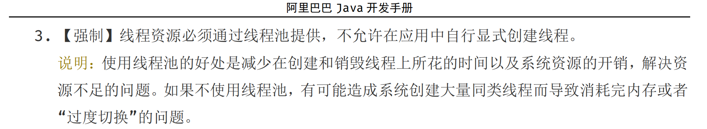
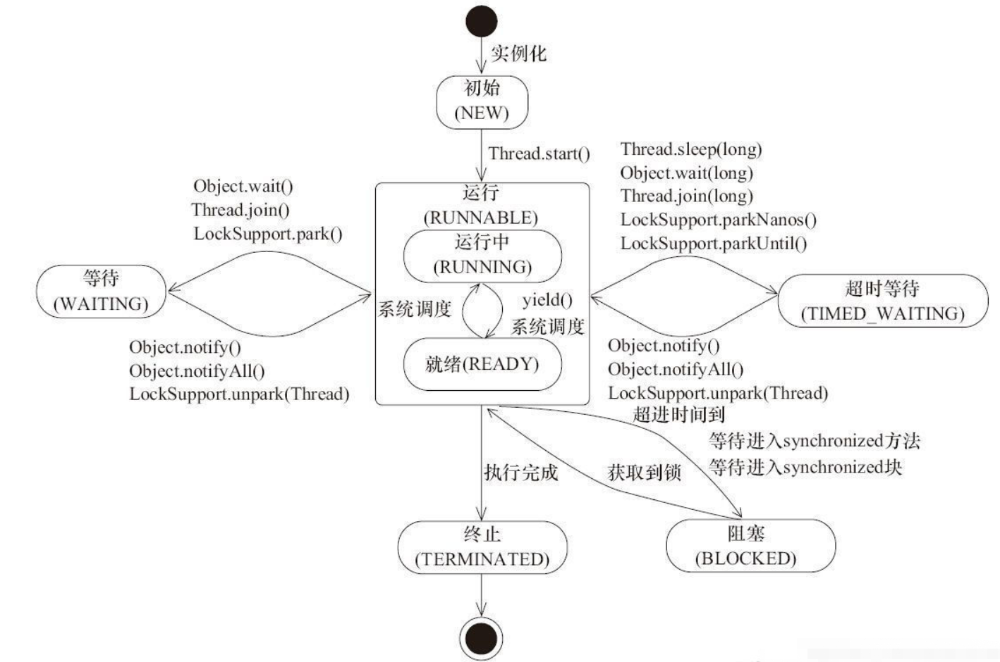
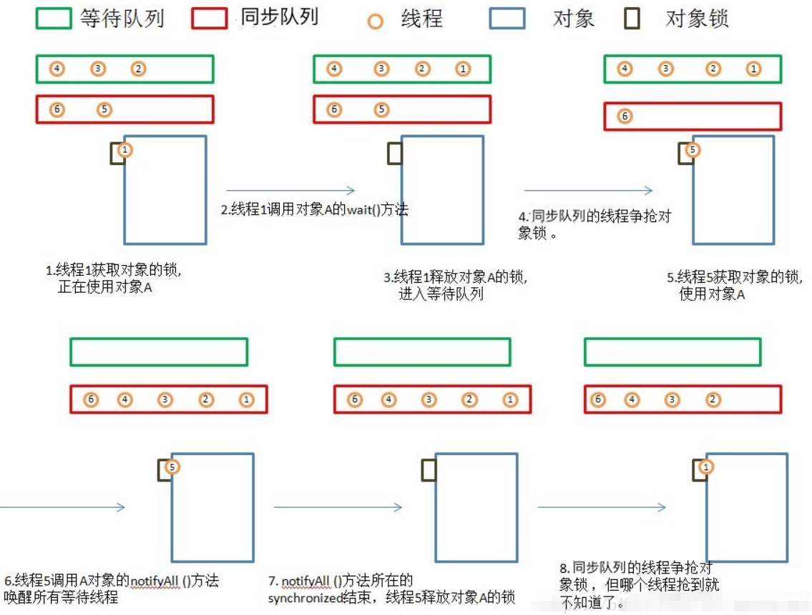
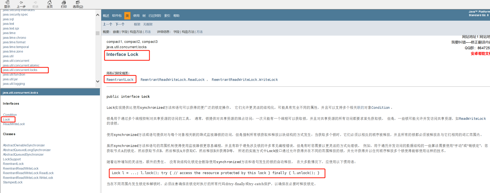

## Java知识复习

## 1: 线程

jvm是多线程的至少有一个主线程和一个gc线程

### 1.1: 线程的并发和并行

- 并发

如果系统支持两个或者多个动作同时存在，不同时执行， 那么这个系统就是并发系统。

并发的关键是你有处理多个任务的能力。

- 并行

如果系统支持两个或者多个动作同时执行，那么这个系统就是并行系统。

并行的关键是你有同时处理多个任务的能力。

### 1.2: 线程实现的三种方式

- 1：继承Thread类
- 2：实现Runnable接口
- 3：实现Callable接口

线程资源必须通过线程池提供， 不允许在应用中自行显示创建线程。




### 1.3: 线程的生命周期



>1：初始（New）：新创建一个线程对象，但还没调用start()方法。
>
>2：运行（Runnable）：Java线程中将就绪（ready）和运行中（running）两种状态统称为“运行”。线程对象创建后，其他线程（如main线程）调用了该对象的start()方法。该状态的线程位于可运行线程池中，等待被线程调度选中，获取CPU使用权，此时处于就绪状态（ready）。就绪状态的线程获取CPU时间片后变为可运行状态（running）。
>
>3：阻塞（Blocked）：线程阻塞于锁。
>
>4：等待（Waiting）：进入该状态的线程需要等待其他线程做出一些特定动作（通知或中断）。
>
>5：超时等待（Timed_Waiting）：该状态可以在指定时间后返回。
>
>6：终止（Terminated）：表示线程已执行完毕。

#### 1.3.1：初始状态（NEW）

实现Runnable接口和继承Thread可以得到一个线程类，new一个实例出来，线程就进入了初始状态。

#### 1.3.2：就绪状态（READY）

- 就绪状态说明只是有资格运行，调度程序没有调度到，永远都是就绪状态。
- 调用线程的start()方法，此线程进入就绪状态。
- 当前线程sleep()方法结束，其他线程join()结束，等待用户输入完毕，某个线程拿到对象锁，这些线程都将进入就绪状态。
- 当前线程的时间片用完，调用线程的yield()方法，这些线程进入就绪状态。
- 锁池中的线程拿到对象锁后，进入就绪状态。

#### 1.3.3：运行中状态（RUNNING）

线程调度程序从线程池中选择一个线程运行。这是线程进入运行状态的唯一方式。

#### 1.3.4：阻塞状态（BLOCKED）

阻塞状态就是线程阻塞在进入synchronized关键字修饰的方法或者代码块（获取锁）时的状态。

#### 1.3.5：等待（WAITING）

处于等待状态的线程不会被分配CPU时间片，要么等待被显式唤醒， 要么处于无限等待状态。

#### 1.3.6：超时等待（TIMED_WAITING）

此线程状态不会被分配CPU执行时间，不会无期限的等待被其他唤醒， 在设定时间内没被唤醒会自动唤醒。

#### 1.3.7：终止（TERMINIATED）

- 当线程的run()方法完成时，或者是主线程的main()方法完成时，就认为线程终止。这个线程对象也许是活的，但是已经不是一个单独执行的线程。线程一旦终止就不会复生。
- 在一个终止的线程上调用start()方法，会抛出java.lang.IllegalThreadStateException。

#### 1.3.8：等待队列

- 调用线程对象的wait()方法，notify()方法前，必须获取对象锁，也就是必须写在synchronized(obj)代码段内。
- 与等待队列相关的步骤和图



1. 线程1获取对象A的锁，正在使用对象A。
2. 线程1调用对象A的wait()方法。
3. 线程1释放对象A的锁，并马上进入等待队列。
4. 锁池里面的对象争抢对象A的锁。
5. 线程5获得对象A的锁，进入synchronized块，使用对象A。
6. 线程5调用对象A的notifyAll()方法，唤醒所有线程，所有线程进入同步队列。若线程5调用对象A的notify()方法，则唤醒一个线程，不知道会唤醒谁，被唤醒的那个线程进入同步队列。
7. notifyAll()方法所在synchronized结束，线程5释放对象A的锁。
8. 同步队列的线程争抢对象锁，但线程1什么时候能抢到就不知道了。

### 1.4：线程的几个方法比较

1. Thread.sleep(long millis)：当前线程调用此方法，则进入TIMED_WAITING状态，但是不释放对象锁，millis后线程自动进入就绪状态。

   ```java
   public class Thread implements Runnable {
       ...
   	public static native void sleep(long millis) throws InterruptedException;
       ...
   }
   ```

   

2. Thread.yield()：当前线程调用此方法，则放弃获取CPU时间片，不释放锁资源，由运行状态变为就绪状态，让OS再次选择线程。作用：让相同优先级的线程轮流执行，但并不保证一定会轮流执行。实际中无法保证yield()达到让步目的，因为让步的线程还有可能被线程调度程序再次选中。Thread.yield()不会导致阻塞。该方法与sleep()类似，只是不能由用户指定暂停多长时间。

3. thread.join()/thread.join(long millis)：当前线程调用其他线程t的join()方法，当前线程进入WAITING/TIMED_WATING状态，当前线程不会释放已经持有的对象锁。线程t执行完毕或者millis时间到，当前线程进入RUNNABLE状态或者是BLOCKED状态。

4. obj.wait()：当前线程调用对象的wait()方法，当前线程释放对象锁，进入等待队列。依靠nitify()/nitifyAll()唤醒或者wait(long timeout) timeout时间到自动唤醒。

   ```java
   public class Object {
       ...
   	public final native void wait(long timeout) throws InterruptedException;
       ...
   }
   ```

   

5. obj.notify()：唤醒在此对象监视器上等待的单个线程，选择是任意的。notifyAll()唤醒此对象监视器上所有等待的线程。

6. LockSupport.park()/LockSupport.parkNanos(long nanos)/LockSupport.parkUnitl(long deadlines)：当前线程进入WAITING/TIMED_WATING状态。对比wait()方法，不需要获取锁对象就可以让线程进入WATING/TIMEDwATING状态，需要通过LockSuppot.unpark(Tread tread)唤醒。

### 1.5: 同步代码块和同步方法

wait()，notify()，notifyAll() 只能用在同步方法或同步代码块中。

- 普通实现同步方法

```java
package com.douhl.practice.ThreadDemo;
/**
 * 企业级多线程编程的固定套路
 * 1: 高内聚, 低耦合
 * 2: 线程 (调用线程对外暴露的方法)操作 资源(线程类的属性)
 */
public class ThreadDemo1 {
    // 线程调用资源类方法操作内部资源
    public static void main(String[] args) {
        final SaleTicket saleTicket = new SaleTicket();
        new Thread(() -> {

            for (int i = 0; i < 100; i++) {
                saleTicket.saleTicket();
            }
        }, "a").start();
        new Thread(() -> {
            for (int i = 0; i < 100; i++) {
                saleTicket.saleTicket();
            }
        }, "b").start();
    }
}
/**
 * 售票类
 * 属性: 票数
 * 方法: 对外售票
 */
class SaleTicket{
    private Integer numbers = 100;
    // 售票方法
    public synchronized void saleTicket(){
        if (numbers>0){
            System.out.println(Thread.currentThread().getName()+ " 卖出第 " + numbers-- + " 张票, 还剩下 " + numbers + " 张票.");
        }
    }
}

```

- 最新实现 使用

  ```java
  package com.douhl.practice.ThreadDemo;
  import java.util.concurrent.locks.Lock;
  import java.util.concurrent.locks.ReentrantLock;
  /**
   * 企业级多线程编程的固定套路
   * 1: 高内聚, 低耦合
   * 2: 线程 (调用线程对外暴露的方法)操作 资源(线程类的属性)
   */
  public class ThreadDemo2 {
      // 线程调用资源类方法操作内部资源
      public static void main(String[] args) {
          final SaleTicket saleTicket = new SaleTicket();
          new Thread(()->{
              for (int i = 0; i < 100; i++) {
                  saleTicket.saleTicket();
              }
          }, "A").start();
          new Thread(()->{
              for (int i = 0; i < 100; i++) {
                  saleTicket.saleTicket();
              }
          }, "B").start();
      }
  }
  /**
   * 售票类
   * 属性: 票数
   * 方法: 对外售票
   */
  class SaleTicket2{
      private Integer numbers = 100;
      // 声明锁
      private Lock lock = new ReentrantLock();
      // 售票方法
      public void saleTicket(){
          lock.lock();
          try {
              if (numbers>0){
                  System.out.println(Thread.currentThread().getName()+ " 卖出第 " + numbers-- + " 张票, 还剩下 " + numbers + " 张票.");
              }
          } finally {
              lock.unlock();
          }
      }
  }
  ```

  

### 1.6：线程之间的通信 - 消费者和生产者模型


#### 1.6.1：普通实现生产者和消费者 - wait()，notify()，notifyAll()

```java
/**
 * 生产者和消费者模型
 * 生产者+1
 * 消费者-1
 * 固定模式: 1、判断，2、干活和等待，3、通知
 * 线程创建规则
 * 1、高内聚，低耦合
 * 2、线程 操作 资源类
 */
public class ThreadDemo3 {
    public static void main(String[] args) {
        OperationNum operationNum = new OperationNum();
        new Thread(()->{
            for (int i = 0; i < 10; i++) {
                try {
                    operationNum.increment();
                } catch (InterruptedException e) {
                    e.printStackTrace();
                }
            }
        },"a").start();
        new Thread(()->{
            for (int i = 0; i < 10; i++) {
                try {
                    operationNum.decrement();
                } catch (InterruptedException e) {
                    e.printStackTrace();
                }
            }
        },"b").start();
        new Thread(()->{
            for (int i = 0; i < 10; i++) {
                try {
                    operationNum.increment();
                } catch (InterruptedException e) {
                    e.printStackTrace();
                }
            }
        },"c").start();
        new Thread(()->{
            for (int i = 0; i < 10; i++) {
                try {
                    operationNum.decrement();
                } catch (InterruptedException e) {
                    e.printStackTrace();
                }
            }
        },"d").start();
    }
}
class OperationNum{
    private Integer num = 0;

    // 生产者 +1
    public synchronized void increment() throws InterruptedException {
        // 判断
        while(num!=0){
            // 等待
            this.wait();
        }
        // 否则+1 干活
        num++;
        System.out.println(Thread.currentThread().getName() + " 线程 " + num);
        // 通知
        this.notifyAll();

    }
    // 消费者 -1
    public synchronized void  decrement() throws InterruptedException {
        // 判断
        while (num==0){
            // 等待
            this.wait();
        }
        // 干活
        num--;
        System.out.println(Thread.currentThread().getName() + " 线程 " + num);
        // 通知
        this.notifyAll();
    }
}
```


#### 1.6.2：最新实现生产者和消费者 - lock(), await(), singal()


```java
/**
 * A B C三个线程 A线程输出5次， B线程输出10次， C线程输出15次， A B C 依次输出
 * 线程规则
 * 1、高内聚、低耦合
 * 2、线程 操作 资源类
 * 线程间通信规则
 * 加锁 判断 干活 唤醒 解锁
 */
public class ThreadDemo5 {
    public static void main(String[] args) {
        PrintDemo printDemo = new PrintDemo();
        new Thread(() -> {
            for (int i = 0; i < 5; i++) {
                printDemo.pritn5();
            }
        }, "A").start();
        new Thread(() -> {
            for (int i = 0; i < 5; i++) {
                printDemo.pritn10();
            }
        }, "B").start();
        new Thread(() -> {
            for (int i = 0; i < 5; i++) {
                printDemo.pritn15();
            }
        }, "C").start();
    }
}
/**
 * 资源类
 */
class PrintDemo {
    // 属性
    private Integer num = 1;
    // 锁对象
    private final Lock lock = new ReentrantLock();
    // 锁条件对象
    private final Condition condition_A = lock.newCondition();
    private final Condition condition_B = lock.newCondition();
    private final Condition condition_C = lock.newCondition();
    /**
     * A 线程 打印5次
     */
    public void pritn5() {
        // 上锁
        lock.lock();
        try {
            // while循环判断
            while (num != 1) {
                try {
                    // 等待
                    condition_A.await();
                } catch (InterruptedException e) {
                    e.printStackTrace();
                }
            }
            // 干活 5次循环输出
            for (int i = 0; i < 5; i++) {
                System.out.println(Thread.currentThread().getName() + "线程: " + (i + 1));
            }
            num = 2;
            // 唤醒b
            condition_B.signal();
        } finally {
            // 解锁
            lock.unlock();
        }
    }
    /**
     * B 线程 打印10次
     */
    public void pritn10() {
        lock.lock();
        try {
            // while循环判断
            while (num != 2) {
                try {
                    // 等待
                    condition_B.await();
                } catch (InterruptedException e) {
                    e.printStackTrace();
                }
            }
            // 干活
            for (int i = 0; i < 10; i++) {
                System.out.println(Thread.currentThread().getName() + " 线程： " + (i + 1));
            }
            num = 3;
            // 通知 唤醒
            condition_C.signal();
        } finally {
            // 解锁
            lock.unlock();
        }
    }
    /**
     * C 线程 打印15次
     */
    public void pritn15() {
        // 加锁
        lock.lock();
        try {
            // while循环判断
            while (num != 3) {
                try {
                    // 等待
                    condition_C.await();
                } catch (InterruptedException e) {
                    e.printStackTrace();
                }
            }
            // 干活
            for (int i = 0; i < 15; i++) {
                System.out.println(Thread.currentThread().getName() + " 线程 " + (i + 1));
            }
            num = 1;
            // 通知 唤醒A
            condition_A.signal();
        } finally {
            // 解锁
            lock.unlock();
        }
    }
}
```

### 1.7：锁的理解

被synchronized修饰的方法， 锁对象是调用者， 同一把锁，不同线程，谁先调用，谁先执行

被synchronized 和 static 修饰的方法，锁的对象是本类的class对象。	class对象 是类模板 只有一个， 而对象通过类模板可以创建多个

1.7.1：

### 1.8：线程池技术

#### 1.8.1：线程池创建规则


## 2：网络编程 Socket

IP地址，端口，协议。

127.0.0.1：回环测试地址，255.255.255.255：广播地址。

端口号范围：0—65535，0—1024 范围的端口被系统占用或作为保留端口

### 2.1：TCP和UDP协议区别

### 2.2：Socket通信原理

## 3：反射

### 3.1：Java反射机制作用

运行时确定对象类型，绑定对象。

通过类对象调用 newInstance()方法， String.class.newInstance()

通过类对象的 getConstructor() 或者 getDeclaredConstructor() 方法获取构造器对象（Constructor）并调用 newInstance() 创建对象， String.calss.getConstructor().newInstance("Hello");

1. 运行时判断任意一个对象所属的类。
2. 运行时判断任意一个类所具有的成员变量和方法。
3. 运行时任意调用一个对象的方法。
4. 运行时构造任意一个类的对象。

### 3.2：获取一个对象的方法

1. 类型.class， String.class
2. 对象.getClass()，“Hello”.getClass()
3. Class.forName()，Class.forName("java.lang.String")


